# LP Generator — Tutorial
---

### Buat Brand

Menu **Brands → + New brand**.

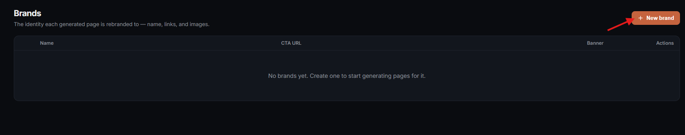

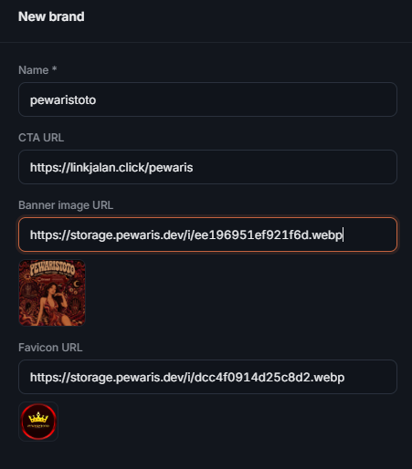

Isi nama, CTA URL, banner, dan favicon default. Save.

### Domain

Menu **Domains → + New domain**.

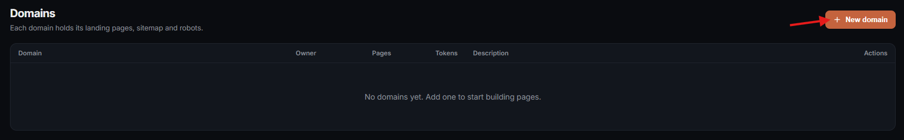

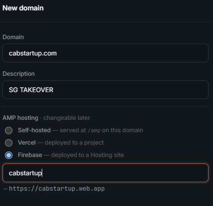

Isi domain, description, dan pilih tempat AMP di-host:
- **Self-hosted** — di `domain.com/amp/` (default).
- **Vercel** / **Firebase** — di-deploy ke eksternal hosting

Save.

**Domain List Table**
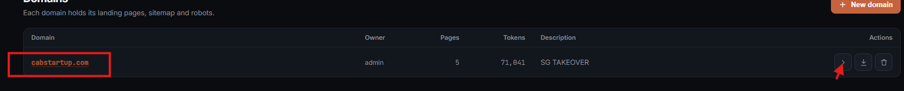
klik nama domain untuk ke halaman detail dan mulai buat page:

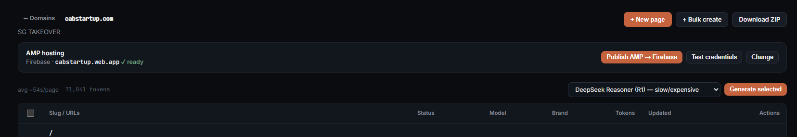
---

## Bikin page — dua cara

### Bulk create (banyak sekaligus)

Buat generate 5–50 page dengan konfigurasi yang mirip (CTA URL, BANNER dan FAVICON URL gunakan default).

Halaman domain → **+ Bulk create**.

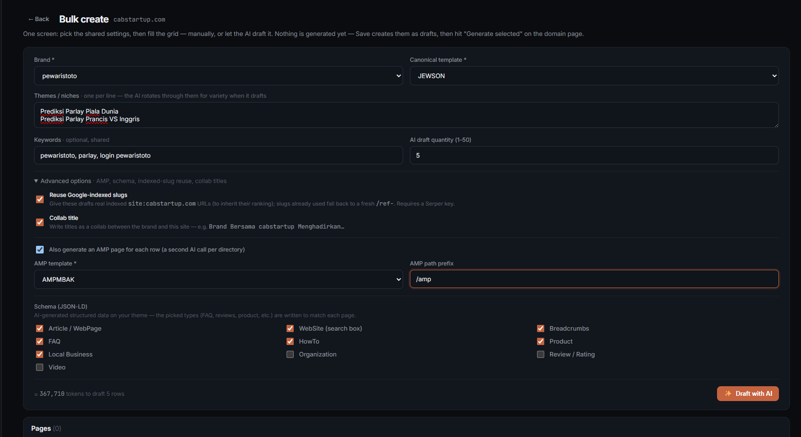

**Atas** (config yang di-share semua row):
- Brand, canonical template, tema (satu per baris), keywords, quantity.
- **Advanced options** — 
**Google-indexed slugs**: jika di centang akan gunakan page yang sudah ter-index google, jika tidak auto-generate dir dengan format /ref-sesuai-tema (ref-live-draw-macau)
  
**collab title**: draft title kolaborasi mention nama domain di title juga (bisa ter-generate tanpa tld atau dengan tld) eg: Pewaristoto kini hadir di domain.com membawakan Live Draw Macau paling update / Pewaristoto X domain_name berkolaborasi menghadirkan situs prediksi togel  

**AMP toggle**: Bisa pilih template AMP nya dan prefix default: /amp

Klik **✨ Draft with AI**. AI bikin N draft row.

**Grid** (edit tiap row):

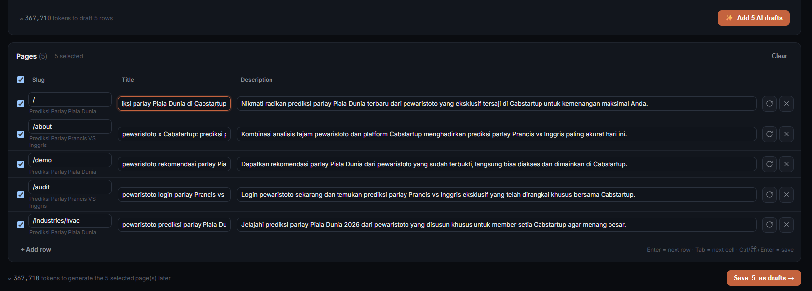

- Gambar Hasil draft yang di-generate AI dengan title dan description sesuai tema, collab title dan page yang sudah ter-index google.
- **+ Add row**: buat row kosong manual.
- **↻** = re-generate title dan desription ulang untuk dir tersebut. **×** = hapus row.

Klik **Save N as drafts →**. balik ke halaman domain,
draft-draft baru sudah pre-selected.

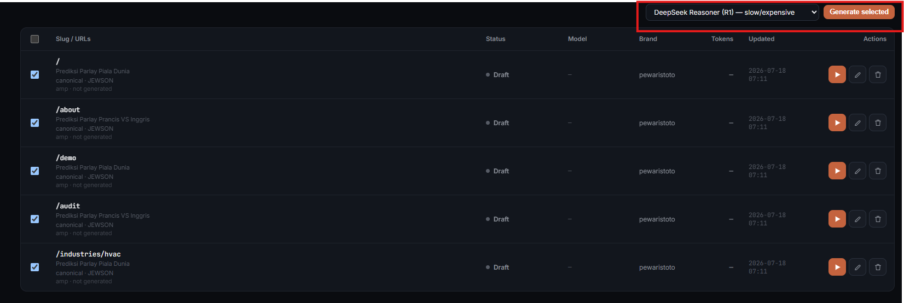
bisa edit satu per satu jika mau ubah CTA URL, BANNER DAN FAVICON yang masih Default atau langsung generate. 

checklist dir yang ingin di generate, Pilih model, klik **Generate selected**. sekarang ini baru bisa generate 2 dir secara bersamaan, lebih dari itu masuk antrean dulu.

### New page (satu page)

Buat generate satu page dengan kontrol per field.

Halaman domain → **+ New page**. Sheet slide dari kanan.

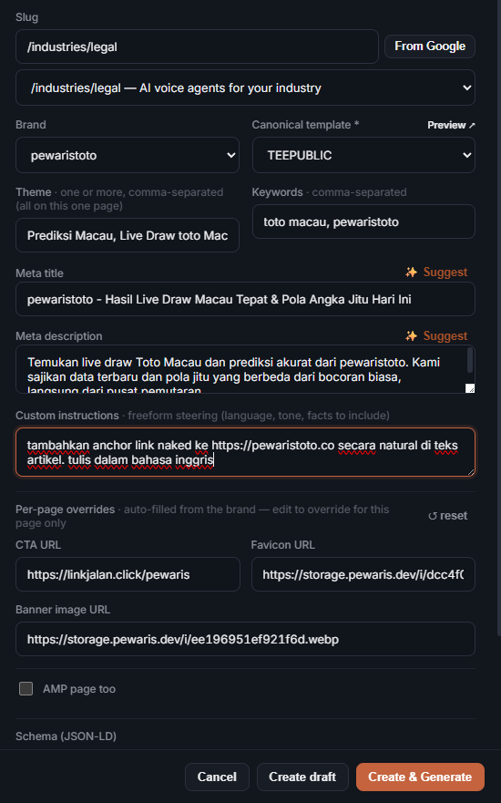

Isi:
- **Slug** — path URL (`/promo/summer`) atau kosong buat homepage.
- **Brand** — pilih. CTA/banner/favicon otomatis keisi dari brand
  (bisa di-edit buat override cuma di page ini).
- **Canonical template**.
- **Theme** — topik page (satu atau beberapa, dipisah koma).
- **Keywords**, **Meta title**, **Meta description** — kalau kosong,
  tombol **✨ Suggest** minta AI drafting-in.
- **Custom instructions** — bebas ("tulis Bahasa Indonesia", "sebut
  bonus 20%", dll.).
- **AMP page too** + template + prefix kalau mau AMP.
- **Schema (JSON-LD)** — centang tipe yang relevan.

Dua tombol save:
- **Create draft** — save doang, generate belakangan.
- **Create & Generate** — save + langsung generate.

---

## Setelah generate

### Edit page

Klik ✏️ di row. Editor: settings kiri, preview kanan.

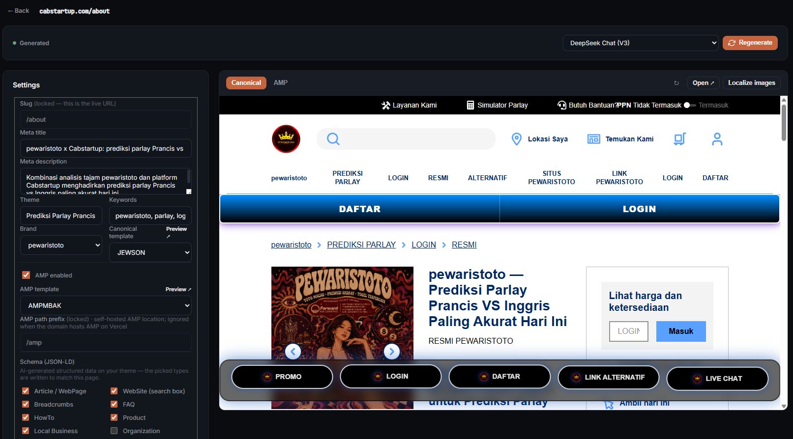

Semua setting bisa diedit (kecuali slug — di-lock setelah generated).
**Save settings** simpan doang, **Regenerate** buat konten baru match
setting baru.

Toolbar preview:
- **↻ Reload** — reload iframe.
- **Open ↗** — buka page di tab baru.
- **Localize images** — download banner + favicon dari eksternal CDN (mbakgroup.io, imagekit) ke local.

### Publish AMP (Vercel / Firebase saja)

Setting **AMP hosting** di atas halaman domain:

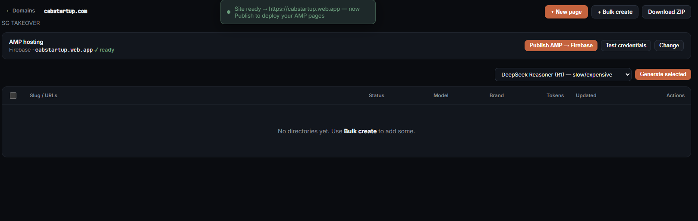

- **Publish AMP → Firebase / Vercel** — deploy semua page AMP di domain
  ini sekaligus.
- **Change** — ganti provider atau nama project.

Auto-publish: setiap page selesai generate, deploy jalan sendiri ~8 detik
kemudian.

### Download ZIP (self-hosted)

Tombol **Download ZIP** di kanan atas halaman domain. download semua dir, amp sitemap dan robots
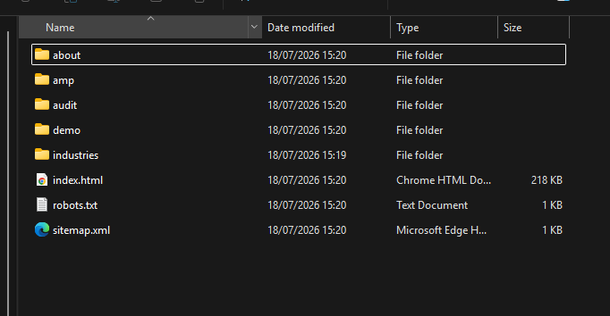

---
